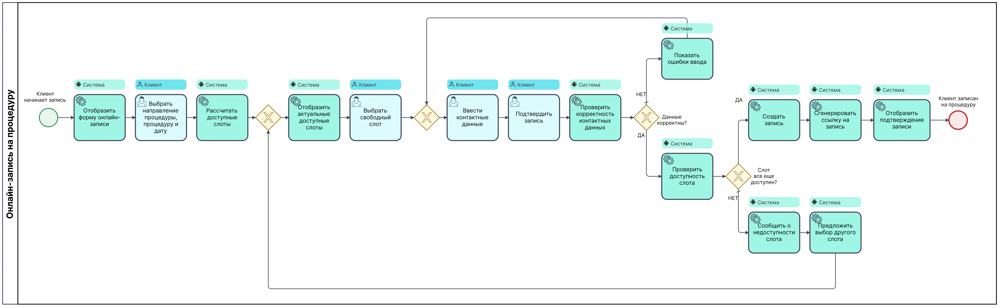

# Основной бизнес-процесс

В данном разделе описан основной бизнес-процесс MVP - онлайн-запись клиента на процедуру.

## Описание бизнес-процесса онлайн-записи на процедуру

| **Название** | **Результат** | **Начало** | **Окончание** | **Используемые ресурсы** |
| ------------ | ------------- |----------- | ------------- | ------------------------ |
| Онлайн-запись | Клиент записан на процедуру Инициирована отправка уведомлений клиенту и мастеру Запись сохранена в системе | Клиент инициировал процесс записи на процедуру | Клиент успешно записан на процедуру или запись не создана | Сайт, форма онлайн-записи, расписание мастера, данные процедур, данные клиента, база данных, сервис уведомлений |

## BPMN-диаграмма

## Исходный файл диаграммы
- [Исходный файл в формате BPMN](./booking-process.bpmn)

## Связанные артефакты
- [UC-01. Онлайн-запись клиента на процедуру](../use-cases/UC-01.booking.md)