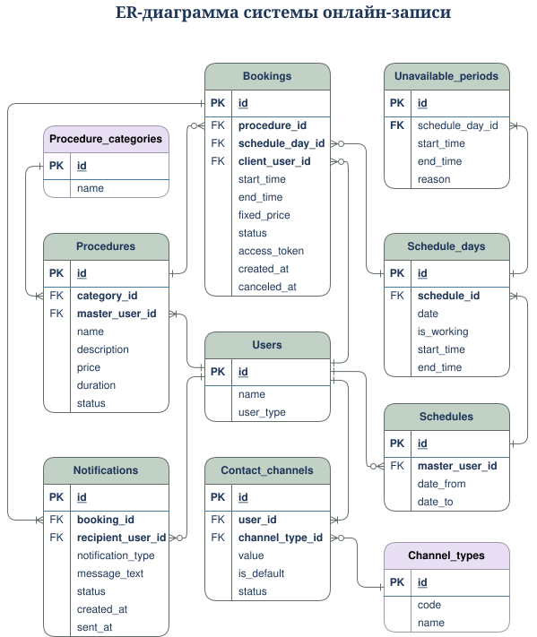

# Модель данных

Раздел описывает логическую модель данных MVP-системы онлайн-записи клиента на процедуру.

Модель включает ER-диаграмму, описание сущностей предметной области, связи между сущностями и CRUD-матрицу.

## ER-диаграмма

> **Чтобы открыть диаграмму в diagrams.net / draw.io нажмите на изображение**

[](https://app.diagrams.net/?title=er-diagram.drawio&dark=0#R%3Cmxfile%3E%3Cdiagram%20name%3D%22%D0%A1%D1%82%D1%80%D0%B0%D0%BD%D0%B8%D1%86%D0%B0-1%22%20id%3D%22QyznNch6mJvRk1DAAry3%22%3E7Z1dk6JIFoZ%2FTV1WB58il2V9zERM90Zv9czs7JVBCaVsoziIXVXz6zdBEjEVPNJimvpGdFQrYorwHng8b57DjXk%2Fff8l8eaTL7EfRDeG5r%2FfmA83hmE4msv%2By5Z8rJb0dWO1YJyE%2FmqRtl7wLfwnWC3U%2BdJl6AeLYtlqURrHURrONxeO4tksGKUby7wkid82V3uNI39jwdwbBxubkS34NvKiYGu1%2F4R%2BOim%2BheGsl%2F8ahOMJ%2F2S9V3zhqcdXLgZeTDw%2FfqssMh9vzPskjtPVo%2Bn7fRBlO29zvzzVvFpuWBLMUsobxo%2F%2F%2B%2Fv38Eu0%2BPP5r7vbfw8fJq%2BLW2N7lGLgRfrB9wHb8nn2MPVeskWDReolaXGoTI0tYDs%2F9cJZkLAFev48irz5IsxXXy2ZhJH%2F2fuIlykfiD8bvIbvgf%2B8OlLZuuygfWaDZU%2BzwV%2FZ4N%2BKjcle9qJwPGOPR2yLs08cJMGCbctnb5EWa0zSacQ%2FN4pngbfejiROvbTyfBr%2FqL6ajVQ8zz568RZOI28WPIVRdB9Hcfb9ZmzA7CV%2BNLV81OXMD%2FxilNfK2jeGeW886Pe9fLcl8feg8krP6t33slci7yWIBt7o%2BzgfSfiobAdU3qU%2FmLbtsOWr4%2FTDi5bFcfqaxKPAX7JvUbwUJGnwXjmqhTB%2BCeJpkCYfbJVJRbuGVij1bS103SqWFcPc6pZbLCkC2uRreEWkjcvR12JkDwo9HqBNc1ubTRquE%2BxzdpgGkzgJ%2F8lkGvFjWxFx9Vj%2FGni%2BsGgQ52cvTTi2xeHZFHu2kp%2FE89%2B9ZBykxYJ5HM7SfPfYA%2FaP7bB77ZN9Y7NtvWfP9fVz9i9bPWEHfMb0woIqGyNg2n4LMn0P0nheDBoFr3z8pDiI2eOXOE3jaRmIm4HZVuDNAt0StmU7A%2FehQbqbAbMl5FbyNRvU%2B7G5ytGlahGlatZKlb01Db3omV3DvNk4Wgkrv6RVDtcO9e3UQ6kBURziuTRm%2B%2Fg1yg%2FzJPT9gJ1XB2%2BTMA2%2Bzb1RttIbu6oLZ1Q1JfX1t2OJqklExWDro3jwaF7ELmozL2UnHfZ9FlvKLLezvVhtRcTKL%2FSrdQcLJslwNv68emdPULN9VWpmx%2FdYp0h98wJ%2FXHWXo59Q3j1gw89gwy6eVyQqWlLvXmzodYUNDlGqPcln4sAPqz%2Baruc8e2P0ouLaM9s4AL2%2Fl3FajHv7Vsjpjq3iaFo%2BEF%2BBPRpn%2Fz%2F9xsdiSlkNt3rhWKL9iRM3YbQTnLf7igTDXiyRGB4i3584XEZMIOM4%2BRi25JNd5%2BLj8UnT6CfUuQs%2BAZ8clU%2F6XfEJj469WnUBKACUSwcUfYflcpbRAEKpjZcpu%2BQEyXC5YH8AKQ25PyqNg1JAKTRK0bWuMMWkIjVXNThFVVEpDxEWFamla%2FWcKeLE6p150wCsUKtUA7AAWDgyLBidwYJBpgVD9ikYuHDtuGCaZF6QrlYAQ6lfP1iMknCehvEM3FCLwtRZc8AGYAMRGzqbjGxRZ81xVQMaVBWV8tBgUafASdcqkKFU7zwJR0gy1EuVOlcOsABYIMJCZ%2FM6LWpCjKsasKCqqNSHBWo6TLpWAQvr%2FMIy8ZBcaCxyoubNwAvgBSIvdDbP0qbOLOOqBi%2BoKirlecE2VNEqeKFUL7tcpcu2XSGugBZ0fYeq0QhF1UYofyyCpJ3adVIPFFPfJAPL7ooMdJ3aBaWUMEh287Kg8Gm7lYRl9kHRdaqnWwobvVDQC0VmTQ%2FV15UvWPRDQT%2BUVhKn2sFACCTDqMmwzrwzXac6vaWwkQ1TVVXKZ8N0nWr1ylcr8mEo6KGJmlwiAWIAMVCJobsuJeQaiVLYIAZVVaU%2BMZhUs1e%2BWkEMpX7zjiHpxxzY0KBsmGgXZKLdZ4dhlA5HE4%2BdWKKWflqvAQxq%2FTTb7Y4VyH4aVzPQFn6aND%2FNJPtppmx7An4a%2FDQmQ7KfJl2w8NPgp7WSONlPA0IgO0bMjnXnp5lkP82U7VBccXZs1Xr3ZWc33he04t2SKtl2ky7qc06iSe7Giza8e3VOduLAGmANImt058SRu5uWwgZrgDXOnDUssmEnXdRgjVrZFzZG7uGBORr1vsPGA3OAOc60%2B79ukS09q16vgA4lZHUBNEF29KSr9Zxp4sT6XT0EM9RpldzBBMwAZiAzQ2c3AdDJXUxKZYMZVJWV%2BsxgkwlXulrBDOtJFIuhH7x6yygFONQLlj7BDeAAcCCCQ2e3AdBt8vw2W3ZzdYADwIE8VU26WgEO6NZHlPWu%2Bw0evc4oX0NSndGmPrhKs%2BHXm7qczvjn6RvDPZeyFVCnOlaBOrpITHoZt%2FqNUPNRBLG%2BFf6rr8ci8y5J1vuD7Z8HbzHZhUo7ypoe%2Bw9PT%2FauYHIf3f6dszcIt4LoaxKPAn%2BZBMMRE%2BOYfcmgXUj1G3ijrGCy3E0CMZpSFy3mOZviB%2FZEP%2BUUcUedjNRwK7qrRnUJtncrycsseSIX80uvjj5CwRMKlWShMbkKX7rMTlGmhPKisykv2lVEj4vsgfkwFS6yMouCyFXwDUlXVZJYimpB%2BeQTuXRdusa6SD2hod0ZJYx0Z8ePCnSmUbUzzb%2FiNHwNR%2Fkd0NqmSdskdTpsS%2BOQ509xKQP7tnMriub7j%2FZj6GRtaRzqj5RS2CpnaRSVFbI9FRmSZ1BJFyza0iBv1Eri5JlUQAjMpJKdgdId8kQqR%2FbUlCueSIVS8cNETZ5vJV3U5zzfSnKp%2BEscf2f7AlXijQImtxUDbgA3iLjRXWcah9wwjAsbuAHcOHfcIHcHky5q4Eat7JNgFM5DdgCH6Ie3T%2FH8AgHqAHUcjTo67E3TJ%2Ft6%2FXq9AjuUkJX6PNEn23rS1XrOPHHquT%2BV6RC4RdUehdN9QPAD%2BIHID931qemTTT2ubPCDqrK6AH4ge3rS1Qp%2BKPU7DRYLbxwMmXzRqaZBsnRvD%2BgAdCCiQ3edavpkg64v%2BxYpQAegA9mfk65WoAM61ZBlTXfoAA2ABiI0dDcrk1c4EU7DsvsiABquHhpcursmW62AhvWdeJKAycIfesg2NEibbMUBHAAOVHDobn6lSzbWuLIBDqrK6gLAgWyrSVcrwGGdbcjmSIIamtS6w4BDnxNV%2B5wMVnVILfNrvQYeKFucmLpACHZ3hED2z7iKQbSblwaFT92tJCy1xYlLts9c2YYEWpygxQmTIdlBky5YtDhBi5NWEie7aUAIJMWISbHOzLSyySBBrrLtiSvOia0KjNk1aLZxAHp%2FL%2BO0GPf2rZDUHVvF0bR8IL7CzmLl1XCoVxYCguzXSQ%2BIc067Sa5Xnpd31kGpcpPYyQ4eYAWwQoSVzgw8Q6MaeKWwASuAlUuGFapHKD8gACv1nuFowlglCoa%2B9wFeaVQxuXgPvAJeIfJKd61VDI3qJ5bKBrAAWC4ZWKiOpfyAALDUz46O0AqOJne63wleAa8QeaWzVi6GRr57tlZ%2FZ0%2FwihKyUh8m%2BBldAbWeM0ycvh47SYdpiJtBNkmb7kICHAAORHDorJELYxLqqVivn%2BsPcFBCVhcADmQfUbpaAQ6lfoOZD2zYI2x6zSCwAdhAxIbuZp%2FqVD%2BvVDawQVVZXQA2kN086WoFNpT6zUt9h%2FMkHIEcGhRLLyUEOYAciOTQ3VRQneqslcoGOagqqwsgB7KvJl2tIAd0jqXKmm8HoAHQcDRoMLqbjmlQXbVyOwENqspKfWjg%2B0IBtQIaSv16o1GwWAxTNuoM6FAvWXovTqAD0IGIDt3NjDTIlXZc2UAHVWV1AehA9tWkqxXogKbzB0kbLToBDkcHh%2B5mRhrkijdDdstDgAPAgWyrSVcrwGENDt5sFEQgh2Ztmzuyv2g8f7C2GxvPP%2FYfnp7sXRp3H93%2BnbM3Nra0fT%2Fx2KkjGqYf86CdF1f2d2jsMq8LXeZ7%2FEbhx0cCk5zYNffo81oRVuFzdSsJy%2Bwyb5jkagkubHSZR5d5iRBrknO10gWLLvPoMt9K4uQELxACWTBiFqy7Oh%2BTXDlhym77hCTY1SfBTHLKVrpakQRbJ8FiHwU%2BDVIlZ3ZBDCAGIjF0V99jkismTNm9nUAMV08MPCwUUCuIodTvzEMzkSZRwy%2B7oBs1%2FzHzfnhhlH2B4TxIwthv6aZZDVhQ66Z1d89mwyK7aRbAFm7ajWQ3zSK7aVzYcNPgpslkW7KbJl2wcNPgprWSONlNA0IgN0bMjXXnpllkN82S7U%2BcT25M8i1TntoRxWVmy8j%2BmnT9Ilu2dZ%2BsF35Xq63bFpb3vno59o2vLjG7RvbjwBxgDiJzdOfHWWQ%2FzpLtcJwPcyiqKvUJg2ebFVArCAN3BjpI2uQeZuAGcAORGzq8BbJNtufser0CHJSQ1QWAA9mdk65WgAPuDEQXtkO3nYENwAYiNnTXb88hu86O7A5mwIarxwaHbCBLVyuwodRvwq4DMZr0Noh1h9GMGcCqzgD%2BVvHrWs797TUwQe3cX7O75noO2Ul26tuVXTXVKnz6biVhqXN%2FHbLn68i%2BDRDm%2FmLuL5Mh2fWVLljM%2FcXc3zYS51MmgBBtEQKJsRPO%2Fe2T7V8ubOTFpM%2BUzCb%2Fdjc5Uv30WZ%2FsEUsX9TmnzyRPcS%2FnA7fkjevIqfXJRhx4A7xB5I3u5v32yT5cX7azccW8AZAoNEj24aSr9ZxB4sT69ZkoQAz1UiWXe4IYQAxEYuhwxm%2BfbMr1Zd9DCMgAZCB7ctLVCmRYWxqL4VucfGdfH%2BBQL1i6ewdwADgQwaG7Ob8u2YrjygY4qCor9cHBpTtxstUKcECN8UHSJvtxAAeAAxUcupsG7JI9Na5sgIOqsroAcCBbatLVCnBAjfEBwt7hvqFcSPVyoZalQk1EUFsqZHdXe%2BGSXTS3vunkVTOtwifvVhKWWirkkk00V7YtgVIhlAoxGZJ9NOmCRakQSoVaSZzspwEhkBYjpsU6KxUy%2BQwfglxlGxRXnBVDqdBhoia7btJFfc7JM8mlQlN28QiS4XLB%2FqBaqEnuZCcOyAHkICJHZ9VCpkY14kphAzlUVdUFsATViJOv1nNmCQnVQsPXhO0mYEOtXsl1cMAGYAMRG7orGTI1qjlXKhvcoKqsLoAbqN6cfLWCGza5IY1BDbVq1YuzcOCPg8qu2T2hJ14mo6BhNF3frrDPBuZZJ3aVnsTjeOZFj%2Bulq7zUCit0Y1N2wcy%2FS5JcPY%2FPTCO%2Fx1%2B82cfWcc%2FJZGNFvjDTIz%2BJv4fpX%2BzxrfZJ0%2FRiwX%2BzFz%2BZRr94%2FvBeWfvho%2FLka5CEbG%2FnEdBCyeVMnaqS%2FeDVW0brZG%2FKEahuB7s7z9B7ZuXwS3gSRF4a%2Ftg8zFX9NV3r889gu9j7qKxQUNp6E75mC24qk31Mc5MnrKLe54n%2BDlMThL%2Faitr328L7xahaqbh4X%2BOmGMJQpjjU6nhtDXW84HSUCc5%2FgiQ%2BRnRqG4HZ69kHBybbrMq4UsJU551R1Q1UWzs0UHv9wwK1dEH5J9p220A1jd1nmdMFav%2F6AvWT67obwarblorBanBgVydYdfEaV%2FRAqo8Q8R08%2BKjBqjnC%2B9tfVXXhvGGK1kTnweoiWD9ZjpKx6ipHwKLcraIUiB4gPe2wWBVj3RaL8A4gYGGuvnNqAuYXdgVi9Ug%2FT7dD1XEV%2BXWqmz3lolOMFW1vdArv6B14JdWd3Z%2FY5krqigR96ujUjxidu24ncUZX0jO4%2BHFHWqHw2mK9vaAqvMOwDgyvrfRR61%2BVW5ty8oufccTwOmtMlR9cunpkKSZg9geX%2BA7uQpBzq5rwiaIBckDKRrh26a4Qp50Hl3nE4NJ31DedDVlKSoFaqsWTbe6WZL2IxXccyoLW1ie2jidbTIGKodl5PFlHjCfDNHC5av6ppdzlSpxa5Jh7WVAsmzrQYdj6RKd1eGnCr74%2Bb4J1svCyjxleuFzV3WRImXhyxcyFsyecxDdwY5wYTa7Ifryl0cHBJI50%2BrTFMee8dJu2UDKWLNUMNTE09v6SEt9w4A8pV2wp4rRNUogjGeLO6TyWjjlFxdgu37zuUFIun24LhpHR2%2FsbSv%2Bpy5JuCdNILPFbtf8NtXUT%2B66DyWyInXVIpMF7uqnzXZN3NxXJG4FtT8%2FdaoaWTZMNR150V7wwDX0%2FDzShR1kl7Pr8eaW6OHv%2B5E3DKNuZbOck49DbG0bkRmWPz7c3LCwHVv63n%2F%2FV8r%2FmDfv4vlZZcl%2F5yw6olq%2Bg8zeuHrO%2FRr7E5iuzJYN8Zfb0Mf%2F7kP8dVEZ2V8tXm%2BJUXnjaHD1%2FvPoKP981iCfK1hEgyLZFqSd7msRxWpUzU9HkS%2BwH2Rr%2FBw%3D%3D%3C%2Fdiagram%3E%3C%2Fmxfile%3E#%7B%22pageId%22%3A%22QyznNch6mJvRk1DAAry3%22%7D)

---

## Сущности в модели данных

### Назначение сущностей

| **Сущность** | **Назначение** |
| ------------ | -------------- |
| Пользователь | Хранит данные пользователя системы |
| Запись | Хранит данные о визите клиента на процедуру |
| Процедура | Хранит данные о процедуре и статусе доступности для онлайн-записи |
| Категория процедуры | Хранит справочные данные о категориях процедур |
| Расписание | Хранит период расписания мастера |
| День расписания | Хранит настройки конкретного дня в расписании мастера: дату, признак рабочего дня, время начала и окончания работы |
| Недоступный период | Хранит периоды недоступности внутри конкретного дня расписания: перерыв, личное время или другое ограничение |
| Уведомление | Хранит информацию об отправке уведомлений клиенту и мастеру |
| Тип канала связи | Хранит справочные данные о доступных типах каналов связи: телефон, email, VK, MAX |
| Канал связи | Хранит контактное значение пользователя для выбранного типа канала связи, статус активности и признак канала по умолчанию |

### Расчетный объект: Слот

Слот - это рассчитанный системой временной интервал, доступный клиенту для записи на выбранную процедуру.

Слот не хранится как отдельная сущность модели данных. Его доступность определяется динамически на основе:
- дня расписания
- рабочего интервала дня расписания
- недоступных периодов
- уже созданных активных записей
- длительности выбранной процедуры

Правила формирования слотов описаны в [Бизнес-правилах](../requirements/business-rules.md)

---

## Связи сущностей

**Таблица связей**

| **Сущность 1** | **Связь** | **Сущность 2** | **Описание** |
| -------------- | --------- | -------------- | ------------ |
| Пользователь | 1:0..* | Запись | Один пользователь с типом `client` может быть связан с нулем или несколькими записями через `client_user_id`. В MVP клиентский пользователь создается при первой онлайн-записи |
| Пользователь | 1:0..* | Процедура | Один пользователь с типом `master` может создать ноль или несколько процедур |
| Категория процедуры | 1:1..* | Процедура | Одна категория процедуры включает одну или несколько процедур |
| Пользователь | 1:0..* | Расписание | Один пользователь с типом `master` может иметь ноль или несколько расписаний на разные периоды |
| Расписание | 1:1..* | День расписания | Одно расписание содержит один или несколько дней расписания |
| День расписания | 1:0..* | Недоступный период | Один день расписания может содержать ноль или несколько недоступных периодов |
| День расписания | 1:0..* | Запись | Один день расписания может быть связан с нулем или несколькими записями |
| Процедура | 1:0..* | Запись | Одна процедура может быть выбрана в нуле или нескольких записях |
| Запись | 1:1..* | Уведомление | По одной записи создается одно или несколько уведомлений |
| Пользователь | 1:0..* | Уведомление | Один пользователь может быть получателем нуля или нескольких уведомлений |
| Пользователь | 1:1..* | Канал связи | Один пользователь имеет один или несколько каналов связи |
| Тип канала связи | 1:0..* | Канал связи | Один тип канала связи может использоваться в нуле или нескольких каналах связи |

---

## CRUD-матрица сущностей

Матрица позволяет проверить, что каждая сущность имеет понятное назначение, участвует в сценариях системы и поддерживает необходимые операции создания, чтения и изменения данных.

| **Сущность** | **CREATE** | **READ** | **UPDATE** | **DELETE** |
| ------------ | :---------- | :-------- | :---------- | :---------- |
| Пользователь | Система создает пользователя с типом `client` при первой онлайн-записи в UC-01 | Мастер просматривает данные клиента в карточке записи в UC-05 | Мастер изменяет свои данные в профиле в US-11 | Физическое удаление не предусмотрено в MVP |
| Процедура | Мастер создает процедуру в UC-03 | Клиент и мастер просматривают данные процедур в UC-01 и UC-03 | Мастер изменяет данные процедуры и статус доступности для онлайн-записи в UC-03 | Физическое удаление не предусмотрено в MVP |
| Категория процедуры | Не создается пользователем в MVP | Клиент и мастер используют преднастроенные категории процедур в UC-01 и UC-03 | Не предусмотрено в MVP | Физическое удаление не предусмотрено в MVP |
| Запись | Система создает запись после подтверждения клиентом формы онлайн-записи в UC-01 | Мастер и клиент просматривают данные записи в UC-05 и UC-07 | Система изменяет статус записи на `canceled` при отмене мастером или клиентом в UC-05 и UC-07 | Физическое удаление не предусмотрено в MVP |
| Расписание | Мастер создает расписание на выбранный период в UC-04 | Мастер просматривает расписание в UC-04 | Мастер редактирует период расписания в UC-04 | Физическое удаление не предусмотрено в MVP |
| День расписания | Система создает дни расписания при создании расписания в UC-04 | Мастер и система используют дни расписания в UC-04 и UC-01 | Мастер изменяет признак рабочего дня и рабочий интервал в UC-04 | Физическое удаление не предусмотрено в MVP |
| Недоступный период | Мастер указывает недоступный период в рамках дня расписания в UC-04 | Мастер и система используют недоступные периоды в UC-04 и UC-01 | Мастер изменяет время начала, время окончания, причину или очищает проставленный недоступный период в UC-04 | Физическое удаление не предусмотрено в MVP |
| Уведомление | Система создает уведомление при событиях записи в UC-06 | Система читает данные уведомления для отправки в UC-06 | Система обновляет статус отправки уведомления в UC-06 | Физическое удаление не предусмотрено в MVP |
| Тип канала связи | Не создается пользователем в MVP | Мастер использует преднастроенные типы каналов связи в US-11 | Не предусмотрено в MVP | Физическое удаление не предусмотрено в MVP |
| Канал связи | Система создает канал связи клиента или мастера в UC-01 и US-11 | Клиент и система используют активные каналы связи в US-07 и UC-06 | Мастер изменяет значение, статус активности и канал по умолчанию в US-11 | Физическое удаление не предусмотрено в MVP |

---