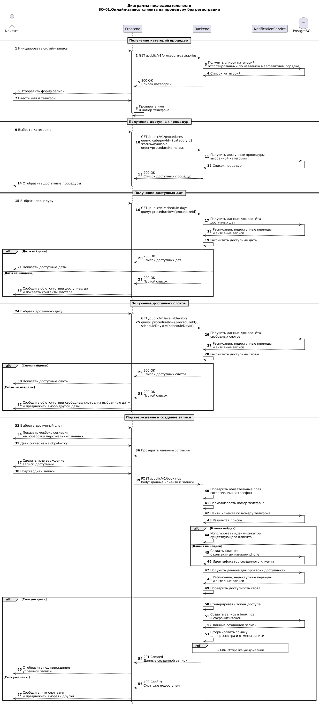

# INT-01. Онлайн-запись клиента на процедуру без регистрации

## Связанные пользовательские сценарии: 
- UC-01. Онлайн-запись клиента на процедуру без регистрации
- UC-06. Отправка уведомлений по записи

## Включаемый сценарий интеграции: 
- INT-06. Отправка уведомлений по записи

## Цель взаимодействия
Обеспечить онлайн-запись клиента на процедуру без регистрации посредством взаимодействия Frontend, Backend и PostgreSQL, включая выбор процедуры и времени, создание записи и запуск отправки уведомлений.

## Участники процесса
- Клиент: Пользователь системы
- Frontend: Клиентское приложение
- Backend: Серверное приложение
- PostgreSQL: База данных

## Триггер

Клиент инициирует онлайн-запись на процедуру

## Предусловия

- Система онлайн-записи доступна
- Запись без регистрации доступна клиенту
- В БД есть категории процедур
- В БД есть процедуры, доступные для онлайн-записи
- У мастера настроено расписание
- Справочник `procedure_categories` актуален и доступен для получения через API
- Системный справочник `channel_types` заполнен до выполнения сценария и содержит тип канала связи `phone`

## Основной сценарий

1. Frontend запрашивает список категорий процедур у Backend
2. Backend запрашивает список категорий у PostgreSQL
3. PostgreSQL возвращает список категорий Backend
4. Backend возвращает список категорий процедур для Frontend, отсортированный по названию в алфавитном порядке
5. Frontend отображает форму онлайн-записи. Поля имени, телефона и категории доступны для заполнения
6. Клиент вводит имя и номер телефона
7. Frontend проверяет корректность имени и номера телефона при вводе
8. Клиент выбирает категорию процедуры
9. Frontend запрашивает процедуры выбранной категории у Backend
10. Backend запрашивает у PostgreSQL список доступных процедур выбранной категории 
11. PostgreSQL возвращает список доступных процедур
12. Backend возвращает список доступных процедур для Frontend
13. Клиент выбирает процедуру
14. Frontend запрашивает список доступных дат у Backend. Параметр `procedureId` - обязательный, параметр `month` - необязательный. Если `month` не передан, Backend возвращает доступные даты за текущий месяц.
15. Backend запрашивает расписание, рабочие дни, недоступные периоды и активные записи у PostgreSQL
16. PostgreSQL возвращает расписание, рабочие дни, недоступные периоды и активные записи Backend 
17. Backend рассчитывает доступные даты с учётом длительности процедуры
18. Backend возвращает список свободных дат для Frontend
19. Клиент выбирает доступную дату визита
20. Frontend запрашивает свободные слоты на выбранную дату у Backend с учетом длительности выбранной процедуры.  
    Метод: `GET /public/v1/available-slots?procedureId={procedureId}&scheduleDayId={scheduleDayId}`
21. Backend запрашивает у PostgreSQL данные расписания, недоступных периодов и активных записей на дату
22. PostgreSQL возвращает расписание, рабочие дни, недоступные периоды и активные записи Backend 
23. Backend рассчитывает свободные слоты с учётом длительности процедуры 
24. Backend возвращает список свободных слотов для Frontend
25. Клиент выбирает свободный слот
26. Frontend отображает чекбокс согласия на обработку персональных данных.
27. Клиент дает согласие
28. Frontend делает подтверждение записи доступным
29. Клиент подтверждает запись
30. Frontend запрашивает создание записи у Backend
    Метод: `POST /public/v1/bookings`  
    Тело запроса: данные клиента и записи
31. Backend проверяет обязательные поля, наличие согласия, корректность имени и номера телефона
32. Backend нормализует номер телефона клиента
33. Backend запрашивает у PostgreSQL клиента по нормализованному номеру телефона
34. PostgreSQL возвращает Backend результат поиска клиента
35. Backend запрашивает у PostgreSQL актуальные данные расписания, недоступных периодов и активных записей для повторной проверки выбранного слота
36. PostgreSQL возвращает актуальные данные Backend
37. Backend повторно проверяет доступность выбранного слота
38. Backend использует идентификатор существующего клиента, если клиент найден
39. Backend создает клиента и одновременно сохраняет для него контактный канал типа phone со значением нормализованного номера телефона, если клиент не найден
40. PostgreSQL возвращает Backend идентификатор клиента, если был создан новый клиент
41. Backend использует идентификатор найденного или созданного клиента для создания записи
42. Backend генерирует токен доступа к записи
43. Backend создаёт запись в `bookings` и сохраняет токен доступа к записи
44. PostgreSQL возвращает Backend данные созданной записи
45. Backend формирует ссылку для просмотра и отмены записи
46. Backend инициирует отправку уведомлений клиенту и мастеру через `INT-06`
47. Backend возвращает Frontend данные успешно созданной записи
48. Frontend отображает клиенту подтверждение успешной записи

## Альтернативные сценарии

18а. Нет доступных дат для выбранной процедуры 
1. Backend возвращает пустой список дат
2. Frontend сообщает, что для выбранной процедуры нет доступных дат
3. Frontend показывает контакты мастера

24а. Нет свободных слотов на выбранную дату
1. Backend возвращает пустой список слотов
2. Frontend предлагает выбрать другую дату

31а. Не заполнены обязательные поля или данные некорректны 
1. Backend возвращает ошибку валидации. Запись не создаётся

## Исключения
37а. Выбранный слот стал недоступен
1. Backend возвращает ошибку конфликта
2. Frontend предлагает выбрать другой слот 

43а. Ошибка создания записи
1. Backend не сохраняет запись и возвращает ошибку
2. Frontend отображает сообщение об ошибке

---

## Диаграмма последовательности: изображение и исходный код

 

- [Исходный код диаграммы PlantUML](../sequence_diagrams/SQ-01.booking.puml)

---

## Используемые методы

| **№** | **Назначение** | **Метод** |
|---:|---|---|
| 1 | Получить список категорий процедур | `GET /public/v1/procedure-categories` |
| 2 | Получить список доступных процедур | `GET /public/v1/procedures?categoryId={categoryId}&status=available&order=procedureName,asc` |
| 3 | Получить доступные даты для выбранной процедуры | `GET /public/v1/schedule-days?procedureId={procedureId}&month={yyyy-MM}` |
| 4 | Получить свободные слоты на выбранную дату | `GET /public/v1/available-slots?procedureId={procedureId}&scheduleDayId={scheduleDayId}` |
| 5 | Создать запись клиента на процедуру | `POST /public/v1/bookings` |

---