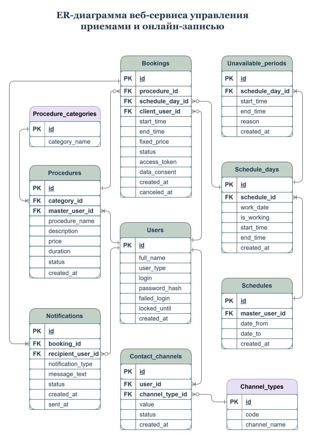

# Модель данных

Раздел описывает логическую модель данных MVP-системы онлайн-записи клиента на процедуру.

Модель включает ER-диаграмму, описание сущностей предметной области, связи между сущностями и CRUD-матрицу.

## ER-диаграмма

> **Чтобы открыть диаграмму в draw.io/diagrams.net, нажмите на изображение**

---

## Сущности в модели данных

### Назначение сущностей

| **Сущность** | **Назначение** |
|---|---|
| Пользователь | Хранит данные пользователя системы |
| Запись | Хранит данные о визите клиента на процедуру |
| Процедура | Хранит данные о процедуре и статусе доступности для онлайн-записи |
| Категория процедуры | Хранит справочные данные о категориях процедур |
| Расписание | Хранит период расписания косметолога |
| День расписания | Хранит настройки конкретного дня в расписании косметолога: дату, признак рабочего дня, время начала и окончания работы |
| Недоступный период | Хранит периоды недоступности внутри конкретного дня расписания: перерыв, личное время или другое ограничение |
| Уведомление | Хранит данные уведомлений и информацию об их отправке |
| Тип канала связи | Хранит справочные данные о доступных типах каналов связи: телефон, email, VK, MAX |
| Канал связи | Хранит контактные данные пользователя для выбранного типа канала связи и статус активности |

---

## Связи сущностей

| **Сущность 1** | **Связь** | **Сущность 2** | **Описание** |
| --- | --- | --- | --- |
| Пользователь | 1:0..* | Запись | Один пользователь с типом `client` может быть связан с нулем или несколькими записями через `client_user_id`. В MVP клиентский пользователь создается при первой онлайн-записи |
| Пользователь | 1:1..* | Процедура | Один пользователь с типом `master` имеет одну или несколько процедур |
| Категория процедуры | 1:1..* | Процедура | Одна категория процедуры содержит одну или несколько процедур |
| Пользователь | 1:0..* | Расписание | Один пользователь с типом `master` может иметь ноль или несколько расписаний на разные периоды |
| Расписание | 1:1..* | День расписания | Одно расписание содержит один или несколько дней расписания |
| День расписания | 1:0..* | Недоступный период | Один день расписания может содержать ноль или несколько недоступных периодов |
| День расписания | 1:0..* | Запись | Один день расписания может быть связан с нулем или несколькими записями |
| Процедура | 1:0..* | Запись | Одна процедура может быть связана с нулем или несколькими записями |
| Запись | 1:1..* | Уведомление | Для одной записи создается одно или несколько уведомлений |
| Пользователь | 1:0..* | Уведомление | Один пользователь может быть получателем нуля или нескольких уведомлений |
| Пользователь | 1:1..* | Канал связи | Один пользователь имеет один или несколько каналов связи |
| Тип канала связи | 1:0..* | Канал связи | Один тип канала связи может использоваться в нуле или нескольких каналах связи |

---

## CRUD-матрица сущностей

Матрица позволяет проверить, что каждая сущность имеет понятное назначение, участвует в сценариях системы и поддерживает необходимые операции создания, чтения и изменения данных.

| **Сущность** | **CREATE** | **READ** | **UPDATE** | **DELETE** |
|---|---|---|---|---|
| Пользователь | Система создает пользователя с типом `client` при первой онлайн-записи в UC-01 | Косметолог просматривает данные клиента в карточке записи в UC-05 | Косметолог изменяет свои данные в профиле в US-11 | Физическое удаление не предусмотрено в MVP |
| Процедура | Косметолог создает процедуру в UC-03 | Клиент и косметолог просматривают данные процедур в UC-01 и UC-03 | Косметолог изменяет данные процедуры и статус доступности для онлайн-записи в UC-03 | Физическое удаление не предусмотрено в MVP |
| Категория процедуры | Не создается пользователем в MVP | Клиент и косметолог используют преднастроенные категории процедур в UC-01 и UC-03 | Не предусмотрено в MVP | Физическое удаление не предусмотрено в MVP |
| Запись | Система создает запись после подтверждения клиентом формы онлайн-записи в UC-01 | Косметолог и клиент просматривают данные записи в UC-05 и UC-07 | Система изменяет статус записи на `canceled` при отмене косметологом или клиентом в UC-05 и UC-07 | Физическое удаление не предусмотрено в MVP |
| Расписание | Косметолог создает расписание на выбранный период в UC-04 | Косметолог просматривает расписание в UC-04 | Косметолог редактирует период расписания в UC-04 | Физическое удаление не предусмотрено в MVP |
| День расписания | Система создает дни расписания при создании расписания в UC-04 | Косметолог и система используют дни расписания в UC-04 и UC-01 | Косметолог изменяет признак рабочего дня и рабочий интервал в UC-04 | Физическое удаление не предусмотрено в MVP |
| Недоступный период | Косметолог указывает недоступный период в рамках дня расписания в UC-04 | Косметолог и система используют недоступные периоды в UC-04 и UC-01 | Косметолог изменяет время начала, время окончания и причину в UC-04 | Физическое удаление не предусмотрено в MVP |
| Уведомление | Система создает уведомление при событиях записи в UC-06 | Система читает данные уведомления для отправки в UC-06 | Система обновляет статус отправки уведомления в UC-06 | Физическое удаление не предусмотрено в MVP |
| Тип канала связи | Не создается пользователем в MVP | Косметолог использует преднастроенные типы каналов связи в US-11 | Не предусмотрено в MVP | Физическое удаление не предусмотрено в MVP |
| Канал связи | Система создает канал связи клиента при первой онлайн-записи в UC-01. Косметолог добавляет свои каналы связи в US-11.| Система использует активные каналы связи для отправки уведомлений в UC-06. Косметолог просматривает свои каналы связи в US-11. | Косметолог изменяет значение и статус активности канала связи в US-11 | Физическое удаление не предусмотрено в MVP |

---