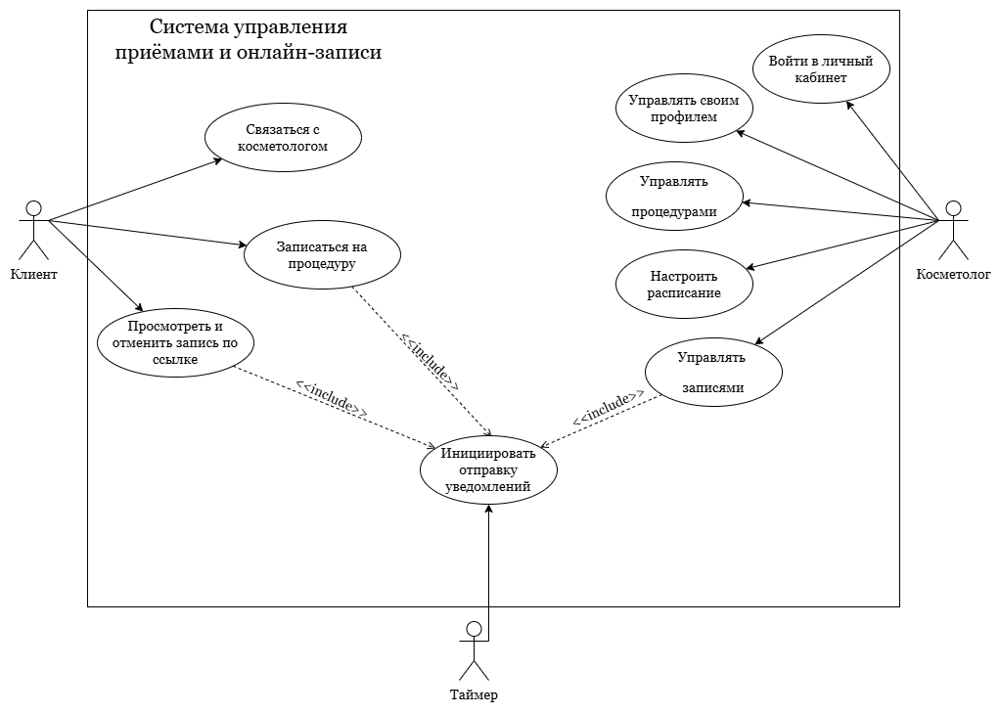

# Сценарии использования

Раздел содержит сценарии использования MVP сервиса управления приёемами и онлайн-записи в кабинет косметологоа.

## Диаграмма сценариев использования

## Сценарии

- [UC-01. Онлайн-запись клиента на процедуру без регистрации](./UC-01.booking.md)
- [UC-02. Вход в личный кабинет косметолога](./UC-02.master-authorization.md)
- [UC-03. Управление процедурами](./UC-03.procedures-management.md)
- [UC-04. Настройка расписания](./UC-04.schedule-settings.md)
- [UC-05. Просмотр и отмена записей косметологом](./UC-05.booking-management.md)
- [UC-06. Отправка уведомлений по записи](./UC-06.notifications.md)
- [UC-07. Отмена записи клиентом по ссылке](./UC-07.cancel-client.md)

## Исходный файл

- [Исходный файл диаграммы сценариев использования](./use-case-diagram.drawio)