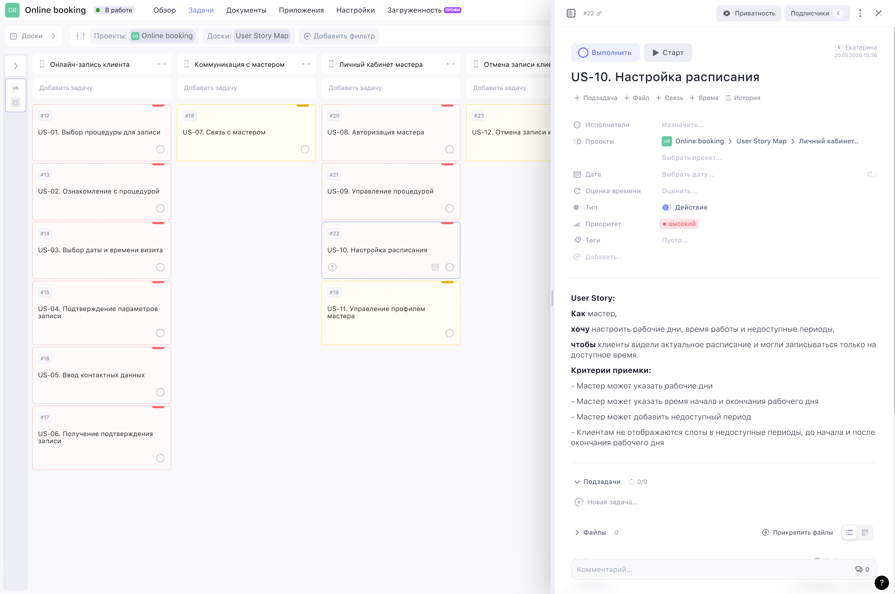

# Пользовательские истории

Раздел содержит пользовательские истории MVP-системы онлайн-записи клиента на процедуру.

User Stories дополнительно оформлены в WEEEK в виде доски и сгруппированы по функциональным блокам MVP.

> **Чтобы открыть User Story Map в WEEEK - нажмите на изображение**

---

## US-01. Выбор процедуры для записи

**Связанный UC:** [UC-01. Онлайн-запись клиента на процедуру без регистрации](../use-cases/UC-01.booking.md)

`Как` клиент,  
`хочу` выбрать процедуру из каталога,  
`чтобы` записаться на нужную услугу.

**Критерии приемки:**
- Клиент видит список категорий процедур
- Клиент может выбрать категорию
- Клиент видит процедуры выбранной категории
- Клиент может выбрать процедуру

---

## US-02. Ознакомление с процедурой

**Связанный UC:** [UC-01. Онлайн-запись клиента на процедуру без регистрации](../use-cases/UC-01.booking.md)

`Как` клиент,  
`хочу` ознакомиться с кратким описанием, стоимостью и длительностью процедуры,  
`чтобы` принять решение о записи.

**Критерии приемки:**

- Клиент видит карточку процедуры в форме записи, после выбора процедуры
- В карточке процедуры отображаются название, краткое описание, стоимость и длительность процедуры

---

## US-03. Выбор даты и времени визита

**Связанный UC:** [UC-01. Онлайн-запись клиента на процедуру без регистрации](../use-cases/UC-01.booking.md)

`Как` клиент,  
`хочу` выбрать дату и время визита,  
`чтобы` спланировать свое время.

**Критерии приемки:**

- Клиент видит календарь с доступными датами
- Клиент может выбрать дату визита
- Система отображает свободные временные слоты на выбранную дату
- Клиент может выбрать свободный временной слот

---

## US-04. Подтверждение параметров записи

**Связанный UC:** [UC-01. Онлайн-запись клиента на процедуру без регистрации](../use-cases/UC-01.booking.md)

`Как` клиент,  
`хочу` проверить и подтвердить параметры записи,  
`чтобы` убедиться, что процедура, дата и время выбраны корректно.

**Критерии приемки:**

- Клиент видит выбранные параметры записи в форме онлайн-записи: свои контактные данные, категорию процедуры, процедуру, длительность и стоимость процедуры, дату и время визита
- Клиент может подтвердить выбранные параметры записи после заполнения всех полей формы: категорию процедуры, процедура, дата, время визита и контактные данные
- Клиент может вернуться к предыдущему шагу и изменить параметры записи до подтверждения

---

## US-05. Ввод контактных данных

**Связанный UC:** [UC-01. Онлайн-запись клиента на процедуру без регистрации](../use-cases/UC-01.booking.md)

`Как` клиент,  
`хочу` ввести имя и номер телефона,
`чтобы` завершить запись на процедуру и получить информацию о визите.

**Критерии приемки:**
- Клиент видит поля ввода контактных данных
- Клиент может ввести имя и номер телефона в любой последовательности до подтверждения записи
- Система не требует регистрации для отправки контактных данных
- Система сообщает об ошибке, если контактные данные заполнены некорректно или не заполнены вовсе
---

## US-06. Получение подтверждения записи

**Связанный UC:** [UC-01. Онлайн-запись клиента на процедуру без регистрации](../use-cases/UC-01.booking.md)

`Как` клиент,  
`хочу` получить подтверждение успешной записи,  
`чтобы` быть уверенным, что визит забронирован.

**Критерии приемки:**
- После завершения записи данных клиент видит подтверждение успешной записи
- В подтверждении отображаются параметры записи: категория и название процедуры, дата и время визита, длительность и стоимость процедуры, а также рекомендации к визиту
- В подтверждении отображается информация, что ссылка для просмотра и отмены записи будет отправлена клиенту в СМС
- Система инициирует отправку уведомления клиенту с подтверждением записи и ссылкой для просмотра и отмены записи
---

## US-07. Связь с косметологом

**Связанные требования:** FRQ-13. Отображение каналов связи

`Как` клиент,  
`хочу` видеть доступные способы связи с косметологом в футере сайта,  
`чтобы` быстро выбрать удобный канал для связи.

**Критерии приемки:**
- Клиент видит активные каналы связи с косметологом на главной странице сайта
- При нажатии на иконку канала связи - открывается канал связи косметолога, например страница косметолога во VK
---

## US-08. Авторизация косметолога

**Связанный UC:** [UC-02. Авторизация косметолога](../use-cases/UC-02.master-authorization.md)

`Как` косметолог,  
`хочу` войти в личный кабинет,  
`чтобы` управлять процедурами, расписанием, профилем и записями.

**Критерии приемки:**
- Косметолог видит форму авторизации
- Косметолог может ввести логин и пароль
- Косметолог может отправить данные для входа
- Если логин и пароль корректны, система авторизует косметолога
- После успешной авторизации система открывает личный кабинет косметолога
- Если логин или пароль некорректны, система сообщает об ошибке авторизации
- Неавторизованный пользователь не получает доступ к личному кабинету косметолога
---

## US-09. Управление процедурой

**Связанный UC:** [UC-03. Управление процедурами](../use-cases/UC-03.procedures-management.md)

`Как` косметолог,  
`хочу` создавать и редактировать процедуры,  
`чтобы` клиенты видели актуальный список процедур, доступных для записи.

**Критерии приемки:**
- Косметолог может создать новую процедуру
- Косметолог может изменить название, описание, стоимость, длительность и статус процедуры
---

## US-10. Настройка расписания

**Связанный UC:** [UC-04. Настройка рабочего расписания](../use-cases/UC-04.schedule-settings.md)

`Как` косметолог,  
`хочу` настроить дни расписания, время работы и недоступные периоды,
`чтобы` клиенты видели актуальное расписание и могли записываться только на доступное время.

**Критерии приемки:**
- Косметолог может создать расписание на выбранный период
- Косметолог может настроить день расписания как рабочий или нерабочий
- Для рабочего дня косметолог может указать время начала и окончания работы
- Для рабочего дня косметолог может добавить недоступный период или очистить его
---

## US-11. Управление профилем косметолога

**Связанные требования:** FRQ-07. Управление профилем косметолога

`Как` косметолог,  
`хочу` редактировать свои данные и доступные каналы связи,  
`чтобы` клиенты видели актуальную информацию и могли выбрать удобный способ связи.

**Критерии приемки:**
- Косметолог может изменить свое имя
- Косметолог может включить или отключить канал связи 
- Косметолог может изменить или указать значение канала связи
---

## US-12. Отмена записи клиентом

**Связанный UC:** [UC-07. Отмена записи клиентом по ссылке](../use-cases/UC-07.cancel-client.md)

`Как` клиент,  
`хочу` отменять свою запись по ссылке,  
`чтобы` самостоятельно освободить время, если я не могу прийти.

**Критерии приемки:**
- Клиент может открыть запись по ссылке
- Клиент видит параметры записи
- Клиент может отменить запись до наступления времени начала записи
- После отмены записи система изменяет статус записи на `canceled`
- После отмены записи время освободажется в расписании косметолога и становится доступно для записей
- После отмены записи клиент видит подтверждение отмены
- После отмены записи система инициирует отправку уведомления косметологу
---